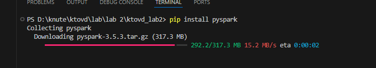

# ktovd_lab2

pip install pyspark



set SPARK_HOME=C:\path\to\spark
set HADOOP_HOME=C:\path\to\spark\bin


```
PS D:\knute\ktovd\lab\lab 2\ktovd_lab2>  & 'd:\knute\ktovd\lab\lab 2\ktovd_lab2\.venv\Scripts\python.exe' 'c:\Users\chere\.vscode\extensions\ms-python.debugpy-2024.10.0-win32-x64\bundled\libs\debugpy\adapter/../..\debugpy\launcher' '55527' '--' 'd:\knute\ktovd\lab\lab 2\ktovd_lab2\part1.py'
 '55527' '--' 'd:\x5cknute\x5cktovd\x5clab\x5clab 2\x5cktovd_lab2\x5cpart1.py' ;b1a6c076-2d0d-4ee6-b7e9-555d0ab4219024/10/01 12:23:32 WARN Shell: Did not find winutils.exe: java.io.FileNotFoundException: java.io.FileNotFoundException: Hadoop home directory C:\hadoop does not exist -see https://wiki.apache.org/hadoop/WindowsProblems
Setting default log level to "WARN".
To adjust logging level use sc.setLogLevel(newLevel). For SparkR, use setLogLevel(newLevel).
24/10/01 12:23:32 WARN NativeCodeLoader: Unable to load native-hadoop library for your platform... using builtin-java classes where applicable
+----+---+
|Name|Age|
+----+---+
|John| 30|
| Doe| 25|
|Jane| 28|
+----+---+
```